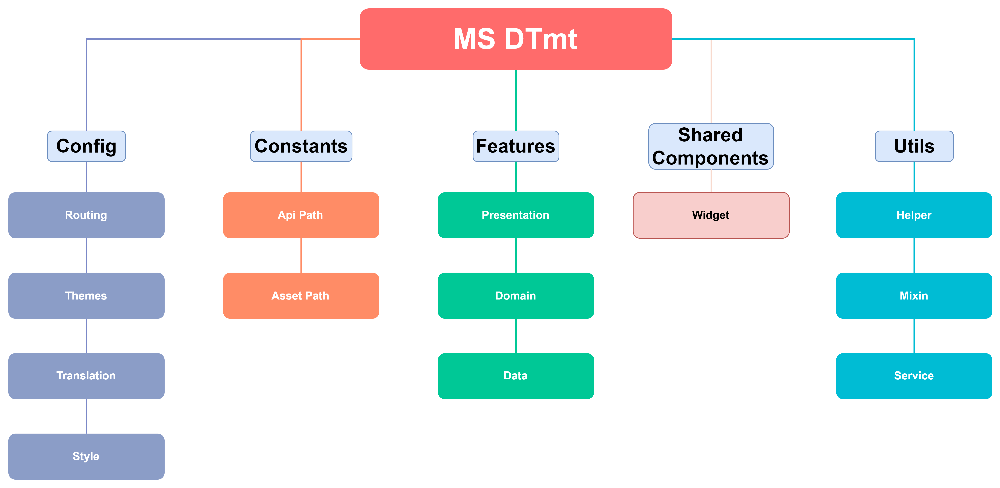
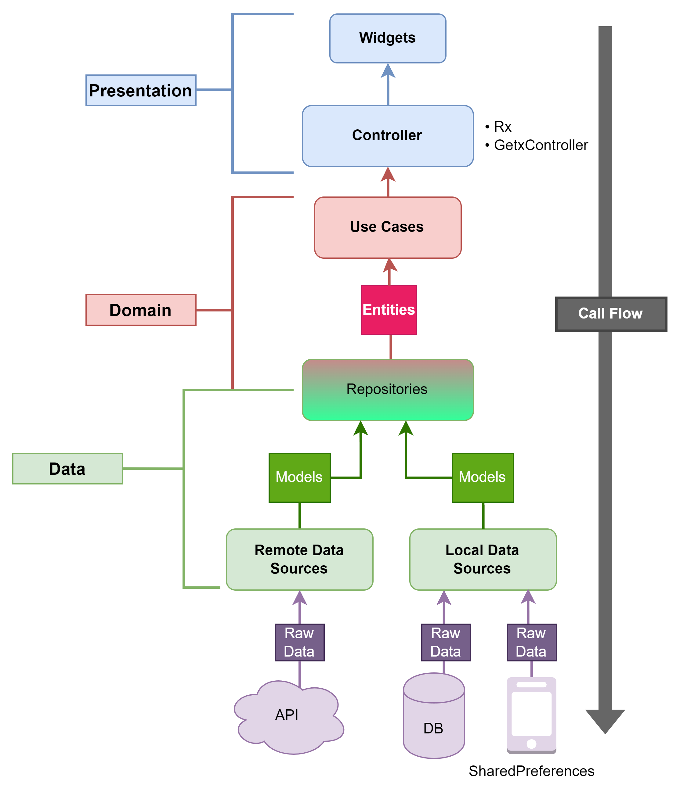

# MSDTmt - Trail Making Test Application

## What is the Trail Making Test (TMT)?

The Trail Making Test (TMT) is a standardized cognitive assessment used to evaluate visual attention, task-switching ability, and executive function. The test consists of two parts:
- **TMT-A**: Connecting numbers in sequence (1-2-3...)
- **TMT-B**: Alternating between numbers and letters (1-A-2-B...)

The test measures the completion time, errors, and other metrics that help assess cognitive function.

This project is a digital implementation of the Trail Making Test (TMT), providing randomly generated cognitive assessments for clinical evaluation. The application dynamically generates test circles, records user performance, and provides comprehensive performance metrics analysis, transforming the traditional paper-and-pencil TMT into a reliable and consistent digital experience.


## Project Structure

This project follows Clean Architecture with a Feature-First structure. Code is organized by feature, each as a self-contained module.

It uses GetX for state management, dependency injection, routing, and utilities.

For more detailed documentation, please visit our online documentation hosted on ReadTheDocs: [MSDTmt documentacion](https://2025-peng-xiaoyang-cogtests.readthedocs.io/en/latest/).

This documentation is automatically published and updated on ReadTheDocs. It provides comprehensive information about the project's architecture, implementation details, and usage guidelines.

### Project Directory Structure

The project follows a typical Feature-First directory organization with Clean Architecture layers:

```
lib/
+---app/
|   +---config/                    # Application-wide configuration
|   |   +---routes/                # Route definitions
|   |   +---themes/                # Theme configurations
|   |   +---translation/           # Internationalization
|   +---constans/                  # Constants used across the app
|   +---features/                  # Feature modules (Feature-First)
|   |   +---home/                  # Home feature
|   |   |   +---data/              # Data layer
|   |   |   |   +---datasources/   # Data sources (local/remote)
|   |   |   |   +---repositories/  # Repository implementations
|   |   |   +---domain/            # Domain layer
|   |   |   |   +---entities/      # Business models
|   |   |   |   +---repository/    # Repository interfaces
|   |   |   |   +---usecases/      # Use cases (business logic)
|   |   |   +---presentation/      # Presentation layer
|   |   |       +---binding/       # Dependency injection
|   |   |       +---components/    # UI components
|   |   |       +---controllers/   # GetX controllers
|   |   |       +---screens/       # Screen widgets
|   |   +---splash/                # Splash screen feature
|   |   +---tm_tst/                # Trail Making Test feature
|   |   |   +---data/              
|   |   |   |   +---datasources/   
|   |   |   |   +---repositories/  
|   |   |   +---domain/            
|   |   |   |   +---entities/      
|   |   |   |   |   +---metric/    # Test metrics entities
|   |   |   |   |   +---result/    # Test result entities
|   |   |   |   |   +---tmt_game/  # Game-specific entities
|   |   |   |   +---repository/    
|   |   |   |   +---usecases/      
|   |   |   |       +---tmt_result/# Result-related use cases
|   |   |   +---presentation/      
|   |   |       +---bindings/      
|   |   |       +---components/    
|   |   |       +---controllers/   
|   |   |       +---screens/       
|   |   +---user/                  # User management feature
|   |       +---data/              
|   |       |   +---datasources/   
|   |       +---domain/            
|   |       |   +---entities/      
|   |       |   +---repository/    
|   |       |   +---usecase/       
|   |       +---presentation/      
|   |           +---binding/       
|   |           +---components/    
|   |           +---contoller/     
|   |           +---screen/        
|   +---shared_components/         # Shared UI components
|   +---utils/                     # Utilities
|       +---helpers/               # Helper functions
|       +---mixins/                # Shared behavior
|       +---services/              # Services
|       |   +---net/               # Network services
|       +---ui/                    # UI utilities
```

This structure demonstrates how the application organizes code:
- Feature-First: Each feature (home, splash, tm_tst, user) has its own dedicated directory
- Clean Architecture: Each feature follows the clean architecture layers (data, domain, presentation)
- Shared Resources: Common components and utilities are separated from features
- Consistency: The same structure is repeated across all features for maintainability

### Clean Architecture Overview



The implementation organizes the application into five main components:

#### 1. Config
Contains configuration-related classes:
- **Routing**: Manages screen navigation and routes using GetX route management
- **Themes**: Defines light, dark, and custom themes
- **Translation**: Handles multilingual text resources with GetX internationalization

#### 2. Constants
Maintains application-wide constants:
- **API Path**: Centralized API endpoint definitions
- **Asset Path**: Organized asset file references

#### 3. Features
Core functionality organized by feature:
- **Model**: Data models representing screen information
- **View**: UI components and screen layouts
- **Controller**: State management using GetX controllers

#### 4. Shared Components
Reusable elements across features:
- **Widget**: Custom UI elements (cards, buttons, etc.)
- **Style**: Common styling configurations

#### 5. Utils
Helper utilities:
- **Helper**: Extension functions, type converters, etc.
- **Mixin**: Reusable behavior for navigation, validation, etc.
- **Service**: API clients, database connections, native functionality
- **UI**: Common dialog boxes, snackbars, etc.

### Feature Architecture

Each feature follows a layered architecture that enforces separation of concerns:



#### Data Layer
- **Remote Data Sources**: Handles API interactions
- **Local Data Sources**: Manages database and device storage
- **Models**: Data transfer objects
- **Repositories (Implementation)**: Implements the interfaces defined in the domain layer

#### Domain Layer
- **Entities**: Core business objects
- **Repositories (Interface)**: Defines data access contracts
- **Use Cases**: Encapsulates business logic

#### Presentation Layer
- **Presentation Logic Holders**: State management using GetX controllers
- **Widgets**: UI components specific to the feature

### Data Flow

1. UI events trigger controller methods
2. Controllers invoke use cases
3. Use cases interact with repositories
4. Repositories coordinate between data sources
5. Results flow back up through the layers
6. UI updates based on the new state and GetX reactive variables

This architecture ensures that:
- Business logic remains independent of UI and external frameworks
- Dependencies point inward (outer layers depend on inner layers)
- Components are highly testable through dependency injection
- The application is scalable and maintainable as features grow

### References

- The Clean Architecture implementation is inspired by [Flutter Template](https://github.com/firgia/Flutter_Template)
- The feature architecture is inspired by [Flutter GetX Clean Architecture](https://github.com/phamdinhduc795397/flutter-getx-clean-architecture)


## Generating Documentation with Sphinx

### Windows

1. Install Sphinx:
```bash
pip install sphinx sphinx_rtd_theme
```

2. Navigate to the doc directory:
```bash
cd doc
```

3. Generate the documentation:
```bash
make.bat html
```

### Linux/macOS

1. Install Sphinx:
```bash
pip install sphinx sphinx_rtd_theme
```

2. Navigate to the doc directory:
```bash
cd doc
```

3. Generate the documentation:
```bash
make html
```

## Documentation

### Viewing Project Documentation

After generating the documentation using Sphinx (see above), the project's detailed documentation will be located in the `docs/build/html/index.html` file. This documentation provides comprehensive information about the project's architecture, features, and implementation details.

To access the documentation:
1. Navigate to the `docs/build/html` directory
2. Open the `index.html` file in any web browser
3. Browse through the complete documentation to understand all aspects of the project

The documentation includes detailed descriptions of:
- Architecture and design patterns
- Feature implementations
- API interactions
- User interfaces
- Testing methodologies

For developers who want to understand or modify the documentation source, the RST files are available in the `docs` directory.

## Running the Project

### Prerequisites

Before running the project, users **must create a `.env` file** in the root directory with the following content:

```
API_BASE_URL=http://your_server_ip_address
```

**Note**: A backend server that supports the following API endpoints is required:

#### API Endpoints

1. **`/procesar`** - Validate reference codes
   - **Method**: POST
   - **Request Body**:
     ```json
     {
       "codeid": "reference_code_string"
     }
     ```
   - **Response**: 
     ```json
     {
       "exists": 2,
       "hands": [
         "D",
         "I"
       ],
       "message": "OK",
       "status": "ok"
     }
     ```
   - **Description**: Validates if a reference code is valid and returns whether it exists and which hand(s) were used previously

2. **`/reportar`** - Submit TMT test results
   - **Method**: POST
   - **Request Body**: Combined user profile and test metrics data with the following format:
     ```
     codeid:123234-12
     F_nacimiento:MM-DD-YYYY
     Sexo:M
     Nivel_Educ:D
     Mano:D
     NumCirc:26
     Time_complete:156.6
     Number_Errors:2
     Average_Pause:2.5
     Average_Lift:0.7
     Average_Rate_Between_Circles:0.8
     Average_Rate_Inside_Circles:0.24
     Average_Time_Between_Circles:3.2
     Average_Time_Inside_Circles:2.1
     Average_Rate_Before_Letters:0.9
     Average_Rate_Before_Numbers:0.75
     Average_Time_Before_Letters:3.8
     Average_Time_Before_Numbers:1.98
     Number_Pauses:1
     Number_Lifts:2
     Average_Total_Pressure:12.5
     Average_Total_Size:3.0
     Date_Data:29-12-2025
     Score:36
     DiagInch:10.5
     ```
   - **Response**:
     ```json
     {
       "status": "OK",
       "message": "Result saved successfully"
     }
     ```
   - **Description**: Submits detailed test performance metrics and user information

3. **`/listar`** - Retrieve test results list
   - **Method**: POST
   - **Request Body**:
     ```json
     {
       "codeid": "reference_code_string",
       "date_data": "YYYY-MM-DD"
     }
     ```
   - **Response**:
     ```json
     {
       "status": "OK",
       "data": [
         {
           "date": "YYYY-MM-DD",
           "time_a": 45.3,
           "time_b": 75.2,
           "hand": "I/D",
            "": "// ...other result metrics"
         }
       ]
     }
     ```
   - **Description**: Returns a list of test results for a specific reference code and date

All responses include a `status` field that indicates success (`"OK"`) or failure (`"error"`). In case of errors, a `message` field provides error details.

### Running on Android

#### Debug Mode

```bash
flutter run --debug
```

#### Build for Release

```bash
flutter build apk --release
```

### Running on iOS

#### Debug Mode

```bash
flutter run --debug
```

#### Build for Release

```bash
flutter build ipa
```

### Build App Bundle for Play Store

Before building, add the following to `android/local.properties`:

```properties
storeFile=YOUR_PATH_TO_KEYSTORE
storePassword=YOUR_KEYSTORE_PASSWORD
keyAlias=YOUR_KEY_ALIAS
keyPassword=YOUR_KEY_PASSWORD
```

Then run:

```bash
flutter build appbundle --release
```

Output location:
- **Windows**: `.\build\app\outputs\bundle\release\`
- **macOS/Linux**: `./build/app/outputs/bundle/release/`

## Other Development Commands

### Create Splash Screen

```bash
dart run flutter_native_splash:create
```

### Generate Launcher Icons

```bash
flutter pub run flutter_launcher_icons
```